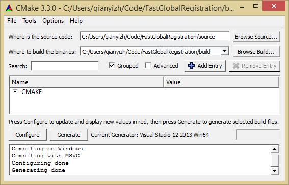

# Fast Global Registration

## Introduction

This is an open source C++ implementation based on the technique presented in
the following paper ([download](docs/fast-global-registration.pdf)):

Fast Global Registration  
Qian-Yi Zhou, Jaesik Park, and Vladlen Koltun  
ECCV 2016  

The source code and dataset are published under the MIT license. See [LICENSE](LICENSE) for details. In general, you can use them for any purpose with proper attribution. If you do something interesting with the code, we'll be happy to know about it. Feel free to contact us.

We include two external libraries ([Eigen](https://eigen.tuxfamily.org/) and [flann](http://www.cs.ubc.ca/research/flann/)) in the codebase for easy compilation. Both of them are under a BSD-style license. See [source/External/README.txt](source/External/README.txt) for details.

## Compilation

FastGlobalRegistration is compiled using [CMake](https://cmake.org/). All dependencies are included in the codebase.

### Ubuntu

The compilation has been tested on Ubuntu 16.04 (gcc 5.4) and Ubuntu 15.10 (gcc 4.9).

```
> mkdir build
> cd build
> cmake ../source/
> make
```

### OS X

The compilation has been tested with El Capitan (Clang or Xcode) and Sierra (Clang or Xcode). Follow the instructions in the Ubuntu section to compile from console with Clang. If you want to use Xcode.
```
> mkdir build-xcode
> cd build-xcode
> cmake -G Xcode ../source/
> open FastGlobalRegistration.xcodeproj/
```

### Windows

The compilation has been tested with Windows 8 and 10, Visual Studio 2013 and 2015. You can use the CMake GUI as follows. Click **Configure** and choose the correct Visual Studio version, then click **Generate**. Open the solution file with Visual Studio, change the build type to **Release**, then **rebuild** the **ALL_BUILD** target.



## Running FastGlobalRegistration

The FastGlobalRegistration program takes three parameters: a file storing the features of the target point cloud, a file storing the features of the source point cloud, an output file that contains a transformation in [.log trajectory file format](http://redwood-data.org/indoor/fileformat.html).

We have provided a synthetic dataset in the [dataset](dataset) folder.

## Parameters
